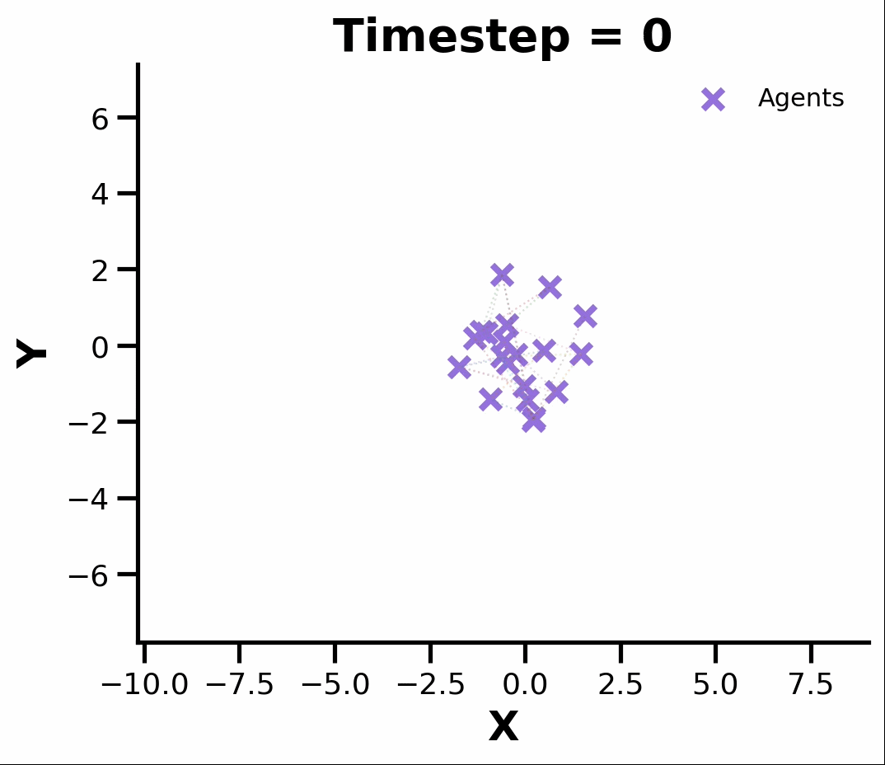

# AI3403-AgentDisplay
A simple formation control algorithm implementation to display names.

## Usage
```bash
python formation_control.py <NAME> <OUTPUT_DIR>
```

<center><h1>Example : SUDHISH</h1></center>



# Formation Control Simulation


## Mathematical Formulation

The simulation models \(N\) agents connected through an Erdős–Rényi communication graph. Each agent has a 2D position

$$
p_i(k) \in \mathbb{R}^2
$$

at timestep \(k\), and a desired formation position

$$
r_i \in \mathbb{R}^2.
$$

### 1. Graph Representation

The communication network is represented by an adjacency matrix \(A\):

$$
A_{ij} =
\begin{cases}
1, & \text{if agents } i \text{ and } j \text{ communicate},\\
0, & \text{otherwise}.
\end{cases}
$$

The graph is generated as an Erdős–Rényi graph with

$$
N = 20, \qquad p = 0.1,
$$

and regenerated until a connected graph is obtained.

### 2. Formation-Control Input

For agent $i$, the control input is

$$
u_i(k) = \sum_{j \in \mathcal{N}_i}\left[\bigl(p_i(k)-p_j(k)\bigr)  \bigl(r_i-r_j\bigr) \right] + k_p\bigl(p_i(k)-r_i\bigr)
$$

where $\mathcal{N}_i\$ is the set of neighbors of agent $i$, and $k_p = 0.1$.

The first term is a **relative-position consensus term**. It drives the agents toward the desired pairwise relative positions and, consequently, the desired formation arrangement. The second term is a **formation anchoring term** that directly attracts each agent toward its assigned target position.

### 3. Position Update

The agents use a discrete-time Euler update:

$$
p_i(k+1) = p_i(k) - \Delta t\,u_i(k),
$$

with

$$
\Delta t = 0.1.
$$

The simulation continues until the formation error falls below the tolerance

$$
\left\|P(k)-R\right\|_F \leq 1,
$$

or the maximum number of steps is reached.

### 4. Stroke Length

Each letter is represented by one or more polylines. For consecutive points \(q_m\) and \(q_{m+1}\), the stroke length is

$$
L = \sum_m
\left\|q_{m+1}-q_m\right\|_2.
$$

This length is used to distribute agents across multiple strokes approximately in proportion to their lengths.

### 5. Arc-Length Sampling

To place \(n\) agents along a stroke, cumulative arc lengths are calculated as

$$
s_0 = 0,
$$

$$
s_m =
\sum_{\ell=0}^{m-1}
\left\|q_{\ell+1}-q_\ell\right\|_2.
$$

The target sampling locations are uniformly spaced along the total stroke length:

$$
s_k = \frac{k}{n-1}L,
\qquad
k=0,\ldots,n-1.
$$

Coordinates at these locations are obtained by linear interpolation.

### 6. Agent Distribution Across Strokes

For a letter containing strokes with lengths \(L_1,\ldots,L_M\), the ideal number of agents assigned to stroke \(m\) is

$$
N\frac{L_m}{\sum_{j=1}^{M}L_j}.
$$

The integer allocations are obtained by flooring these values and then adjusting them until

$$
\sum_{m=1}^{M} n_m = N.
$$

Each non-zero stroke is guaranteed to receive at least one agent.

### 7. Formation Normalization

The generated formation is mapped into a rectangular region of width \(W\) and height \(H\).

For each point \((x_i,y_i)\), the normalized coordinates are

$$
x_i' =
\frac{x_i-x_{\min}}
{x_{\max}-x_{\min}}W,
$$

$$
y_i' =
\frac{y_i-y_{\min}}
{y_{\max}-y_{\min}}H.
$$

When centering is enabled, the coordinates are shifted by half the box dimensions:

$$
x_i'' = x_i' - \frac{W}{2},
\qquad
y_i'' = y_i' - \frac{H}{2}.
$$

The default dimensions are

$$
W = H = 10.
$$

## Outputs

The script generates:

* `Agent_Graph.png` — communication graph
* `FormationError.png` — formation error over time
* `frames/` — timestep-by-timestep images
* `simulation.mp4` — animation of the formation process

The movie is assembled from the generated frames using FFmpeg.
